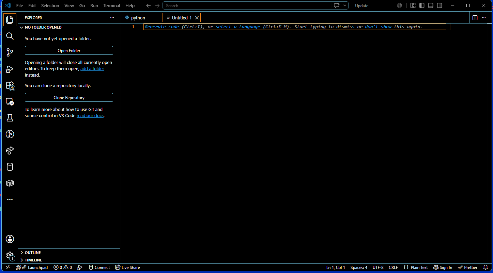
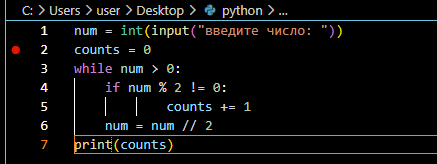
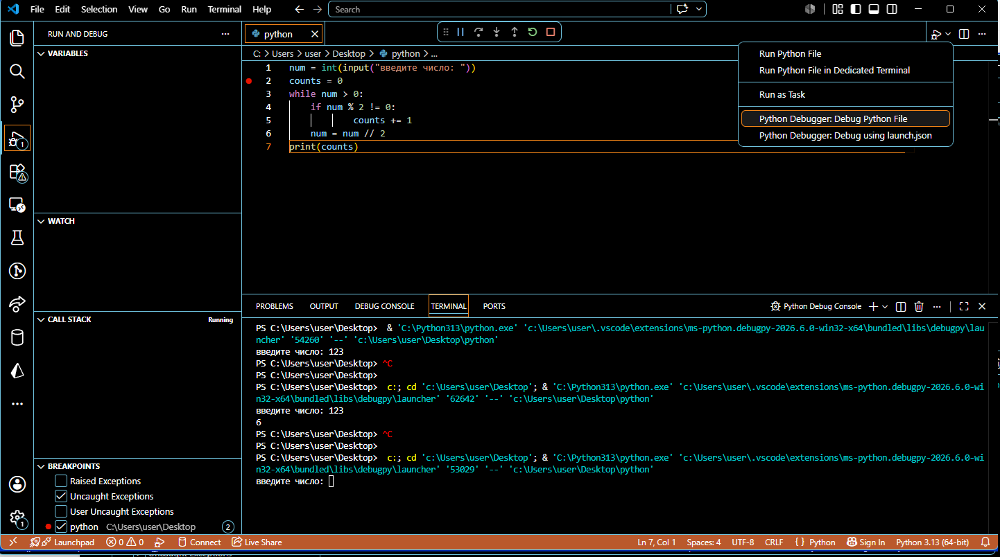
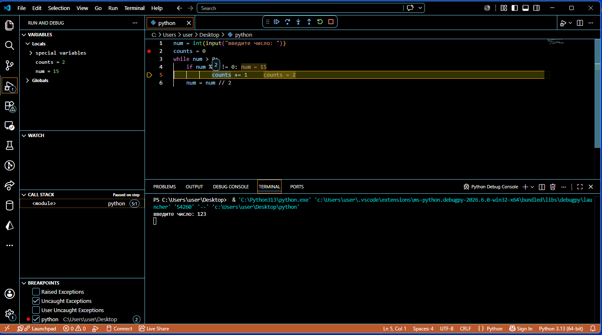
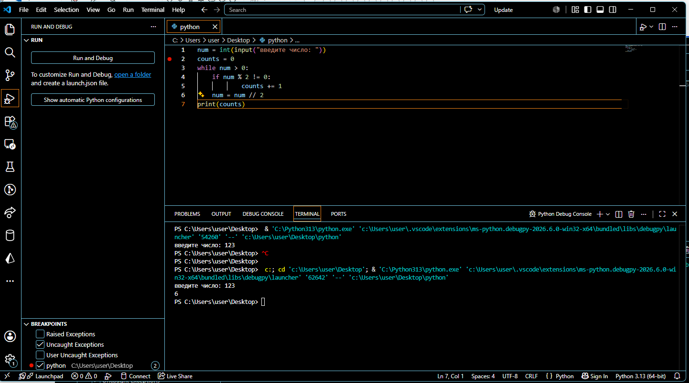

### Рефлексия по предыдущему занятию
был ознакомлен с редактором vim 
### Текущие задачи

### Установите себе полноценную IDE с поддержкой пошаговой отладки программ на Python. Очень популярна PyCharm, Microsoft Visual Studio/Code уже довольно давно хорошо поддерживает Python. Разберитесь, как в IDE работают точки прерывания.

Для работы с python была выбрана IDE Microsoft Visual Studio Code



для примера отладки была выбрана задача

11.3.7. Определите, сколько единичных разрядов (сколько разрядов с цифрой 1, разряды с цифрой 0 не считаются) в двоичном представлении вводимого числа N.
Подсказка: само число переводить в двоичный вид необязательно.
#### Код программы на python
```python
num = int(input("введите число: "))
counts = 0
while num > 0:
    if num % 2 != 0:
            counts += 1    
    num = num // 2
```
Далее была выставлена точка останова на строке 2



Далее запуск кода в режиме отладки 



Проходим по всем шагам с помощью перехода к следующей строке F10



Завершение программы

