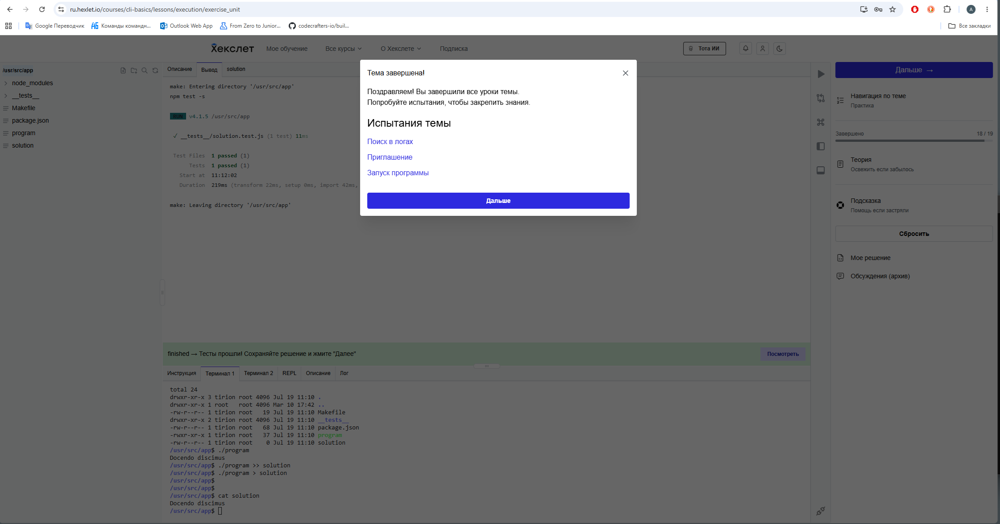
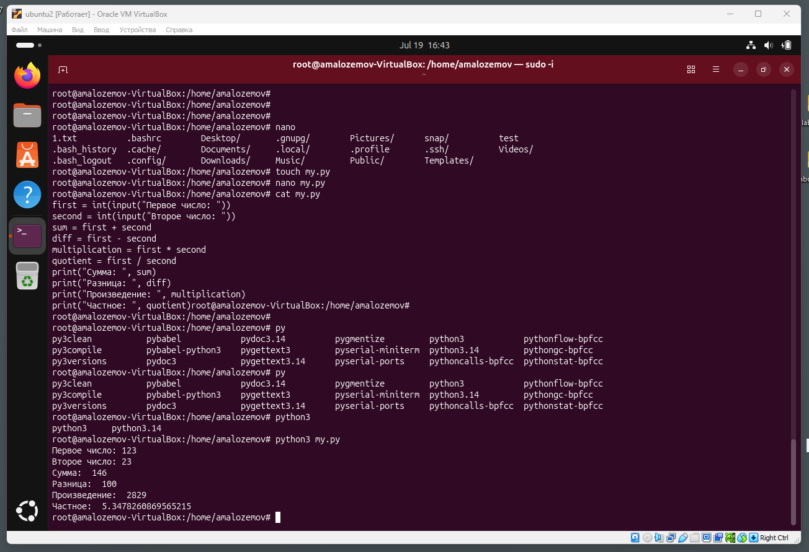

### Рефлексия по рпедыдущему занятию
Курс по командной строке linux закончил
 
### Текущие задачи
### Вывод исполнения задачи в командной строке ubuntu

Вветси два целых числа и вывести в консоль:
- сумму
- разницу
- произведение
- частное
#### Код программы на python
```python
first = int(input("Первое число: "))
second = int(input("Второе число: "))
sum = first + second
diff = first - second
multiplication = first * second
quotient = first / second
print("Сумма: ", sum)
print("Разница: ", diff)
print("Произведение: ", multiplication)
print("Частное: ", quotient)
```
#### Скриншот вывода команды в консоль
