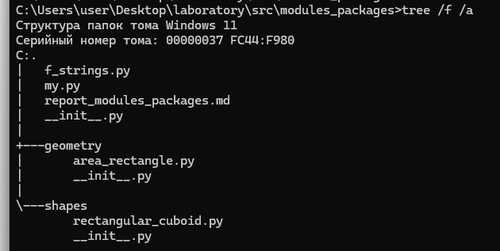
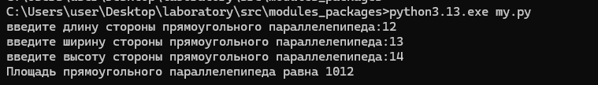
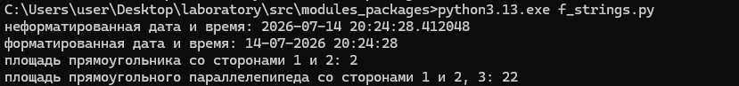

### Рефлексия по предыдущему занятию
Far был установлен + запуск python программы из консоли far manager
### Текущие задачи

### 5.1. Сформируйте два собственных небольших пакета так, чтобы один из них импортировал другой, и затем импортируйте в свою программу оба пакета и используйте произвольные функции из них



Были созданы два каталога geometry и shapes
В пакете geometry был создан python код area_rectangle.py в котором рассчитывается площадь прямоугольника:
#### Код программы на python
```python
def get_rectangle_area(size_a, size_b):
    return size_a * size_b
```
В пакете shapes был создан python код rectangle_cuboid.py в котором рассчитывается площадь прямоугольного параллелепипедас импортом кода из пакета geometry:
#### Код программы на python
```python
from geometry.area_rectangle import get_rectangle_area

def get_rectangular_cuboid_area(length, width, height):
    bottom = get_rectangle_area(length, width)   
    front = get_rectangle_area(length, height)   
    side = get_rectangle_area(width, height)
    
    total_area = 2 * (bottom + front + side)
    return total_area 
```
Финальный этап вызов функций из обоих пакетов:
#### Код программы на python
```python
from shapes.rectangular_cuboid import get_rectangular_cuboid_area

length = int(input('введите длину стороны прямоугольного параллелепипеда:'))
width = int(input('введите ширину стороны прямоугольного параллелепипеда:'))
height = int(input('введите высоту стороны прямоугольного параллелепипеда:'))
print(f'Площадь прямоугольного параллелепипеда равна {get_rectangular_cuboid_area(length, width, height)}')
```
### Скриншот запуска pyhon программы из far


### 5.2. Напишите два примера форматированного вывода с помощью f-строк: для времени и дат (предварительно изучите, как с ними работать) и для ваших импортируемых функций из предыдущего задания

Был создан файл f_strings.py в которым был вызван код с форматированием строк
#### Код программы на python
```python
import datetime
from shapes.rectangular_cuboid import get_rectangular_cuboid_area
from geometry.area_rectangle import get_rectangle_area

dt_now = datetime.datetime.now()
print(f'неформатированная дата и время: {dt_now}')
print(f"форматированная дата и время: {dt_now:%d-%m-%Y %H:%M:%S}")

print (f'площадь прямоугольника со сторонами 1 и 2: {get_rectangle_area(1,2)}')
print (f'площадь прямоугольного параллелепипеда со сторонами 1 и 2, 3: {get_rectangular_cuboid_area(1,2,3)}') 
```
### Скриншот запуска pyhon программы из far
