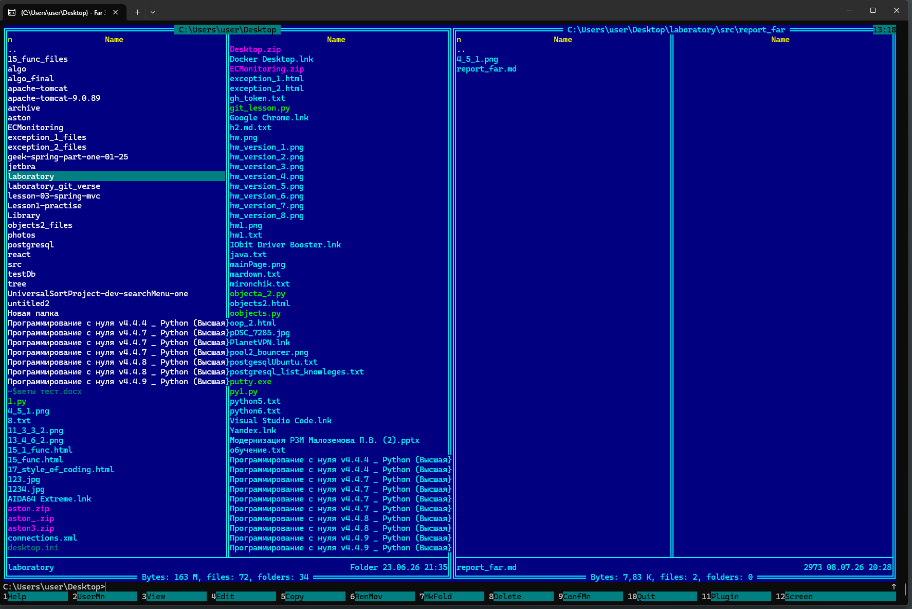
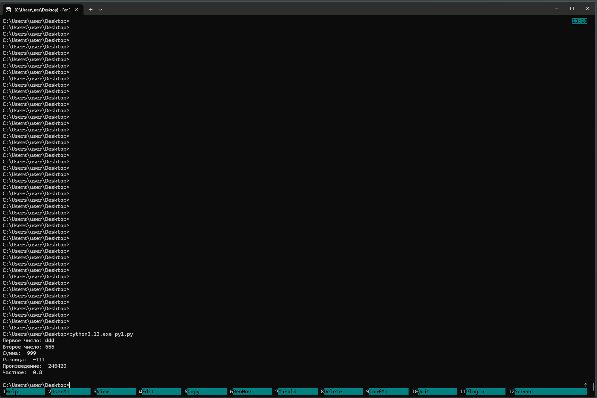

### Рефлексия по предыдущему занятию
Создание отчета в формате md было выполнено + были добавлены скриншоты запуска python программ

### Текущие задачи

### Запуска far manager



### Задача 4.5.1

Вветси два целых числа и вывести в консоль:
- сумму
- разницу
- произведение
- частное
#### Код программы на python
```python
first = int(input("Первое число: "))
second = int(input("Второе число: "))
sum = first + second
diff = first - second
multiplication = first * second
quotient = first / second
print("Сумма: ", sum)
print("Разница: ", diff)
print("Произведение: ", multiplication)
print("Частное: ", quotient)
```
### Скриншот запуска pyhon программы из far
