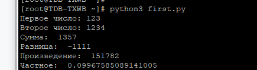
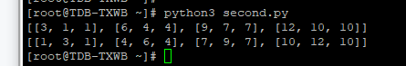
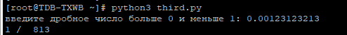

### Рефлексия по рпедыдущему занятию
#### Задача 4.1
В общем решено верно. Композиция для двух иерархий классов была выполнена, мобильный телефон и холодильник были собраны из компонентов.
#### Задача 4.3
В общем задача решена верно. Правильно описана причина вывода
### Текущие задачи
### Задача 4.5.1

Вветси два целых числа и вывести в консоль:
- сумму
- разницу
- произведение
- частное
#### Код программы на python
```python
first = int(input("Первое число: "))
second = int(input("Второе число: "))
sum = first + second
diff = first - second
multiplication = first * second
quotient = first / second
print("Сумма: ", sum)
print("Разница: ", diff)
print("Произведение: ", multiplication)
print("Частное: ", quotient)
```
#### Скриншот вывода команды в консоль

### Задача 13.4.6.2 
Дана матрица целых чисел NxM. Напишите программу, которая выбирает в каждой строке наименьший элемент и меняет его местом с самым первым элементом в этой строке.
#### Код программы на python
```python
m1 = [[3,1,1],
      [6,4,4],
      [9,7,7],
      [12,10,10]
]
print(m1)
count_rows = len(m1)
count_colls = len(m1[0])
i_el = 0
j_el = 0
for i in range(count_rows):
    tmp_min = m1[i][0]
    i_el = i
    j_el = 0
    for j in range(count_colls):
        if tmp_min > m1[i][j]:
            tmp_min = m1[i][j]
            i_el = i
            j_el = j
    tmp_first = m1[i][0]        
    m1[i][0] = m1[i_el][j_el]
    m1[i_el][j_el] = tmp_first
print(m1)
```
#### Скриншот вывода команды в консоль

### Задача 11.3.3.2
Введите дробное число a (больше нуля, но меньше единицы). Из чисел 1, 1/2, 1/3, ... найдите первое число, которое меньше a, и выведите его в виде дроби
#### Код программы на python
```python
num = float(input("введите дробное число больше 0 и меньше 1: "))
order = 1
while (1 / order) > num:
    order += 1
print('1 / ',  order)	
```
#### Скриншот вывода команды в консоль
