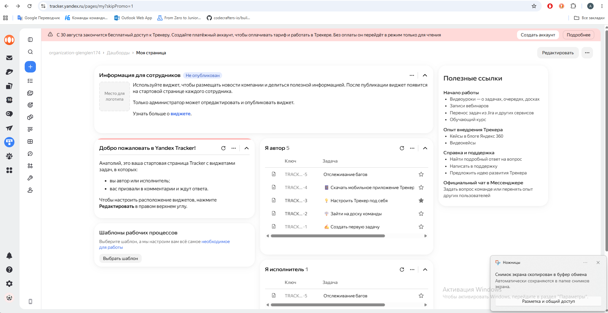
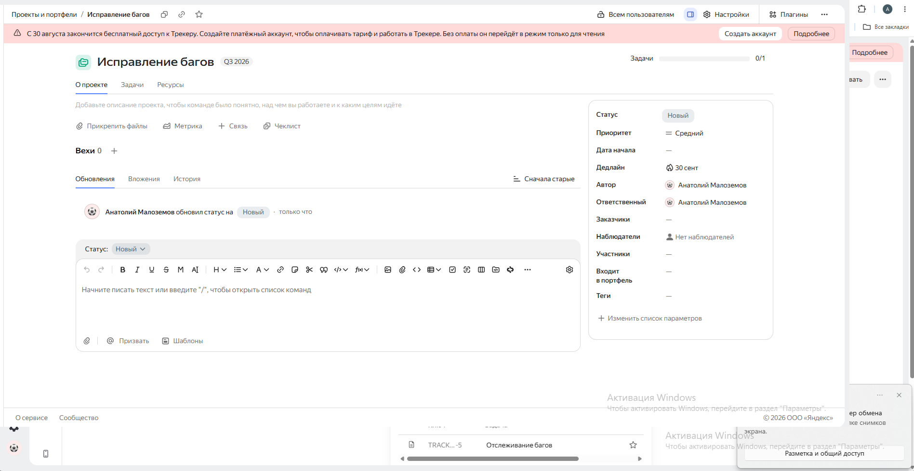
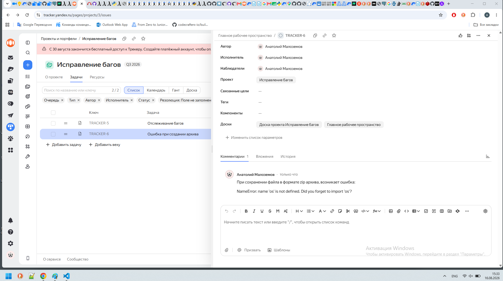

### Рефлексия по рпедыдущему занятию
1 Решено с ошибками: 
- словарь можно было удалить целиком а не по одному элементу
- создание ключа с значения можно было сделать в одном цикле

2 Решено с ошибками:
- нужно было обойтись одни циклом for
- нужно было итерироваться по списку а не по индексам элементов
- для проверки нахождения в словаре надо было использовать стандартный функционал, а не искать элемент по ключу
- проверку на N выполнять внутри цикла, а не отдельным перебором в цикле
### Текущие задачи
### Выбрать систему управления задачами и потестировать ее

Была выбрана трекинговая система от yandex - https://tracker.yandex.ru/

##### Основная страница сервиса

##### Создал проект исправление багов

##### Создал задачу в проекте с описанием проблемы
